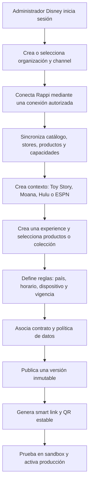
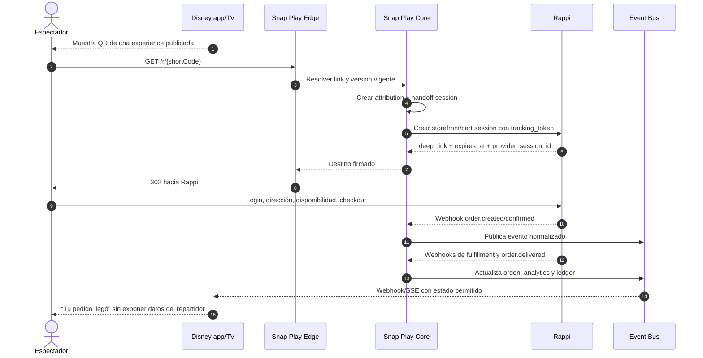

# 1. Producto y flujo del piloto Disney × Rappi

## 1.1 Objetivo

Disney debe poder configurar qué experiencia comercial aparece para cada contexto de contenido —por ejemplo Toy Story, Moana, Hulu o ESPN— utilizando productos y disponibilidad provistos por Rappi Turbo. El espectador escanea un QR, pasa primero por Snap Play y continúa en una experiencia controlada por Rappi para autenticarse, pagar y recibir el pedido.

El piloto debe probar cuatro cosas:

- que el contenido genera intención incremental de compra;
- que la experiencia puede cambiarse sin reimprimir el QR;
- que Snap Play puede atribuir una compra concretada al contenido, placement y contrato correctos;
- que Disney y Rappi pueden conciliar revenue share sin intercambiar más datos de los autorizados.

## 1.2 Vocabulario de dominio

| Concepto         | Definición                                                                                       |
| ---------------- | ------------------------------------------------------------------------------------------------ |
| Organization     | Empresa que usa Snap Play: Disney, Rappi u otro aliado.                                          |
| Connection       | Relación técnica entre dos organizaciones y un conector, con credenciales y capacidades.         |
| Channel          | Marca o superficie de contenido: Disney+, Hulu, ESPN.                                            |
| Content context  | Película, franquicia, programa, evento o contexto editorial: Toy Story, Moana, un partido.       |
| Experience       | Configuración que une contexto, reglas, productos, presentación y destino comercial.             |
| Offer            | Propuesta comercial: productos individuales, colección o bundle.                                 |
| Placement        | Lugar donde se muestra la experiencia: QR en pantalla, overlay, pausa, email o segunda pantalla. |
| Smart link       | URL estable de Snap Play que registra y resuelve el destino vigente.                             |
| Handoff session  | Sesión de atribución creada antes de enviar al usuario a Rappi.                                  |
| Provider order   | Pedido real gestionado por Rappi u otro comercio.                                                |
| Contract version | Reglas económicas y de datos vigentes para una relación durante un período.                      |

## 1.3 Configuración en el backoffice de Disney



El backoffice no debe permitir seleccionar un SKU obsoleto silenciosamente. Antes de publicar debe validar:

- que el producto sigue activo en al menos una tienda elegible;
- que la conexión Rappi está saludable;
- que existe una estrategia de handoff compatible;
- que contrato, moneda, territorio y vigencia son compatibles;
- que la política de intercambio de datos fue aceptada por ambas organizaciones;
- que el destino final pertenece a un dominio/app allowlisted.

## 1.4 Ejemplos de experiences

### Toy Story

- Contexto: `movie:toy-story`.
- Oferta prioritaria: vaso temático, pochoclos, golosinas y merchandising.
- Fallback: categoría tradicional de snacks si el merchandising no está disponible localmente.
- Presentación: “Completá tu noche de película”.

### Moana

- Contexto: `movie:moana`.
- Oferta prioritaria: vaso o merchandising de Moana y bundle familiar.
- Fallback: bebidas, helado y snacks.

### ESPN

- Contexto: `channel:espn` o un evento deportivo concreto.
- Oferta: cerveza sólo donde edad, horario, jurisdicción y políticas lo permitan; papas, hamburguesas, gaseosas y snacks.
- Regla especial: verificación de edad queda en Rappi. Snap Play no afirma elegibilidad ni captura documentos.

### Hulu

- Contexto: `channel:hulu`.
- Oferta: pochoclos, gaseosas y snacks tradicionales.

## 1.5 Resolución del QR y compra



### URL pública

```text
https://go.snapplay.io/r/7E1vM2kP9xQ4
```

El código es aleatorio y no contiene IDs de usuario, película, partner ni contrato. El QR es estable; la versión de experience se resuelve en el servidor.

## 1.6 Estrategias de integración con Rappi

Snap Play declara una capacidad por conexión. No se codifica el comportamiento de Rappi dentro del dominio central.

### Nivel 1 — `STORE_DEEPLINK`

Rappi entrega un deep link por `store_id`.

```text
rappi://store/{store_id}?ref=snapplay&tracking_token={opaque_token}
```

Uso recomendado para el primer piloto si no hay APIs nuevas. Alternativas:

- un `store_id` Disney general;
- stores distintos por franquicia;
- un store Disney con categorías/colecciones si Rappi puede expresarlas en el link.

Limitación: Snap Play no puede garantizar qué productos verá el usuario si Rappi no permite filtrar por SKU o colección.

### Nivel 2 — `DYNAMIC_STOREFRONT` — recomendado

Snap Play solicita a Rappi una sesión de storefront efímera:

```http
POST /partner/v1/storefront-sessions
Authorization: Bearer <service-token>
Idempotency-Key: 43d6ce16-...
```

```json
{
  "store_id": "turbo_ar_palermo_001",
  "allowed_product_ids": ["sku_toy_story_cup", "sku_popcorn_01"],
  "fallback_collection_id": "movie_night",
  "tracking_token": "sp_ht_opaque_01J...",
  "country": "AR",
  "expires_in_seconds": 900,
  "callback_url": "https://api.snapplay.io/v1/provider-events/rappi"
}
```

Rappi responde:

```json
{
  "session_id": "rfs_01J...",
  "deep_link": "rappi://storefront/rfs_01J...",
  "web_url": "https://www.rappi.com.ar/storefront/rfs_01J...",
  "expires_at": "2026-09-01T20:15:00Z"
}
```

Ventajas:

- Rappi conserva precios, stock, restricciones, autenticación y checkout.
- Disney controla la curaduría a través de Snap Play.
- el tracking token viaja hasta el pedido;
- no hace falta mantener muchos stores temáticos.

### Nivel 3 — `CART_HANDOFF`

Snap Play manda productos y cantidades; Rappi valida disponibilidad local y devuelve un carrito prearmado. Es mejor para conversión, pero exige conocer la ubicación o resolverla primero en Rappi.

### Nivel 4 — `ORDER_API`

Snap Play crea el pedido mediante API. No se recomienda para el piloto: aumentaría responsabilidad sobre pagos, fraude, impuestos, cancelaciones, soporte y datos personales.

## 1.7 Catálogo de Rappi

Rappi debe exponer un contrato server-to-server, incremental e idempotente. Opciones compatibles:

1. Snap Play consulta páginas con `updated_since` o cursor.
2. Rappi publica snapshots en object storage y notifica su disponibilidad.
3. Rappi envía webhooks `catalog.product.updated`, `inventory.changed` y `store.changed`.

Modelo normalizado mínimo:

```json
{
  "provider": "rappi",
  "provider_product_id": "sku_toy_story_cup",
  "name": "Vaso temático Toy Story",
  "description": "Vaso coleccionable de 500 ml",
  "image_url": "https://cdn.rappi.example/products/toy-story-cup.png",
  "brand": "Disney",
  "categories": ["merchandising", "movie-night"],
  "gtin": "07791234567890",
  "age_restricted": false,
  "currency": "ARS",
  "reference_price": 14999.0,
  "store_scope": ["turbo_ar_palermo_001"],
  "status": "ACTIVE",
  "updated_at": "2026-08-16T18:00:00Z"
}
```

La pantalla administrativa puede mostrar este catálogo para curación. Sin embargo, precio y stock finales siempre se confirman en Rappi según la ubicación del usuario.

## 1.8 Estados y notificación de llegada

Estados normalizados:

```text
HANDOFF_CREATED → CHECKOUT_STARTED → ORDER_PLACED → ORDER_CONFIRMED
→ COURIER_ASSIGNED → PICKED_UP → NEAR_DESTINATION → DELIVERED
```

Estados alternativos:

```text
EXPIRED | REJECTED | CANCELLED | REFUNDED | PARTIALLY_REFUNDED | FAILED
```

“El rappitendero llegó” debe representarse como `NEAR_DESTINATION` o `ARRIVED_AT_DESTINATION`, nunca inferirse de `PICKED_UP`. Disney sólo recibe el milestone y el identificador seudónimo de la sesión. Nombre, teléfono y ubicación exacta del repartidor no se comparten.

Para notificaciones server-to-server se usan webhooks firmados. Para una pantalla activa, Disney puede:

- consumir Server-Sent Events con un token efímero de la sesión;
- consultar un endpoint de estado con backoff;
- recibir el evento en su backend y enviarlo a su aplicación por su propio canal.

## 1.9 Fuera del MVP, contemplado en el modelo

- múltiples deliveries por experience y reglas de routing;
- YouTube, live video, TikTok Live e Instagram Live mediante adaptadores autorizados;
- plataformas educativas y ofertas asociadas a cursos;
- inserción dinámica por momentos del contenido;
- A/B testing y holdouts para medir incrementalidad;
- optimización automática de producto, bundle y momento;
- storefront propio, sólo si los partners no ofrecen una experiencia adecuada.

Estas extensiones no deben cambiar las entidades centrales: `content_context`, `experience`, `placement`, `offer`, `handoff`, `provider_order` y `attribution`.
