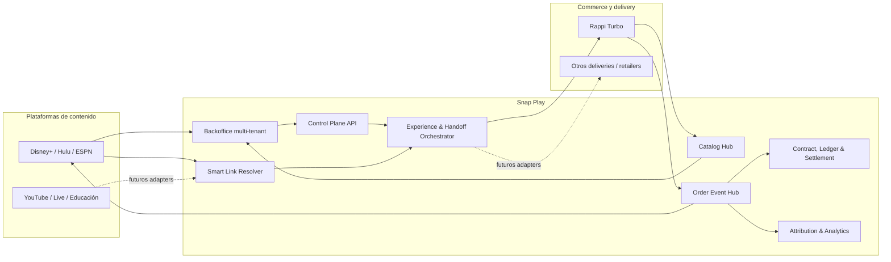
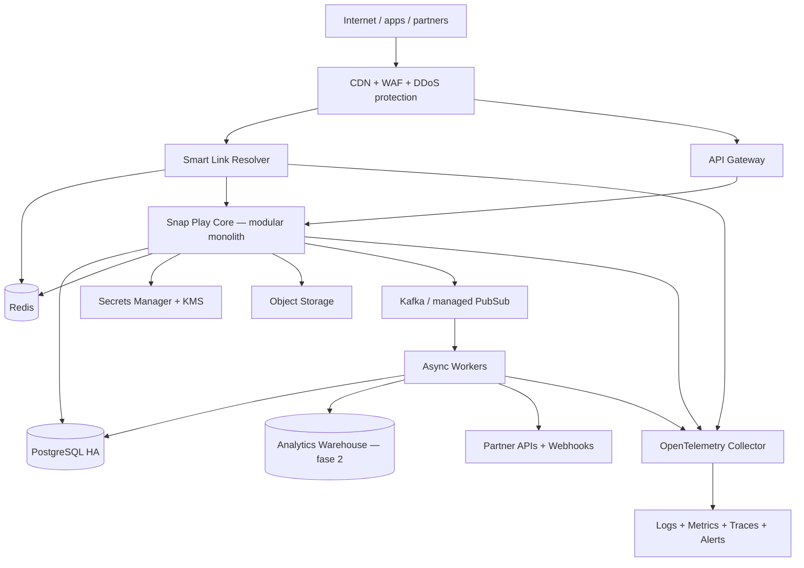
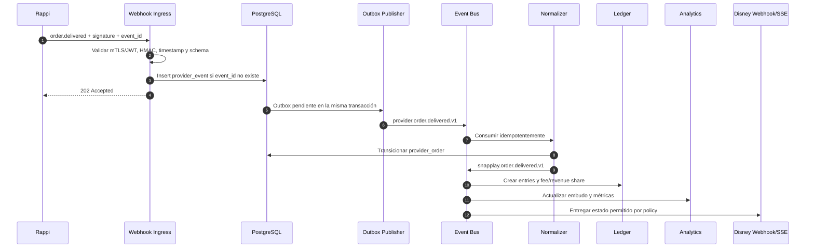

# 2. Arquitectura de backend

## 2.1 Principios

- **Neutralidad:** el core no contiene reglas específicas de Disney o Rappi; usa adapters y capabilities.
- **Control plane y data plane separados:** configurar una experience no debe afectar la disponibilidad del resolver público.
- **Atribución antes del handoff:** toda salida hacia un partner nace de una sesión registrada en Snap Play.
- **Partner owns checkout:** pagos, stock final, dirección, fraude y fulfillment permanecen en el delivery/merchant.
- **Eventos al menos una vez:** consumidores idempotentes, outbox transaccional y reintentos.
- **Versionado inmutable:** experiences y contratos publicados no se editan; se crea una versión nueva.
- **Privacidad por defecto:** analítica agregada; detalle sólo si política, contrato y consentimiento lo permiten.
- **Modularidad antes que microservicios:** monolito modular en el MVP, con extracción sólo donde exista una necesidad demostrada.

## 2.2 Diagrama de contexto



## 2.3 Componentes lógicos

| Componente           | Responsabilidad                                                               | Tecnología MVP                                |
| -------------------- | ----------------------------------------------------------------------------- | --------------------------------------------- |
| Backoffice           | Configurar organizaciones, catálogo, experiences, links, contratos y reportes | React/Next.js o equivalente; OIDC empresarial |
| API Gateway          | TLS, WAF, rate limit, JWT validation, request IDs                             | Managed API Gateway / Envoy / Kong            |
| Identity & Access    | SSO, MFA, RBAC y service accounts                                             | IdP OIDC/SAML; autorización en API            |
| Control Plane        | CRUD versionado y workflows de publicación                                    | Monolito modular, REST/OpenAPI                |
| Smart Link Resolver  | Resolver QR con baja latencia, atribuir y redirigir                           | Servicio stateless en edge + Redis            |
| Experience Engine    | Evaluar vigencia, reglas, fallbacks y oferta                                  | Módulo de dominio; reglas determinísticas     |
| Catalog Hub          | Ingesta y normalización de stores, productos y colecciones                    | Workers + PostgreSQL + object storage         |
| Connector Runtime    | Adapters para catálogo, storefront, cart y eventos                            | Interfaces versionadas por capability         |
| Order Event Hub      | Verificación, deduplicación y normalización de webhooks                       | Endpoint HTTPS + outbox + event bus           |
| Notification Gateway | Webhooks a Disney y estado de sesiones                                        | Workers; webhook delivery; SSE opcional       |
| Contract Engine      | Versiones contractuales y reglas económicas                                   | Módulo de dominio en PostgreSQL               |
| Ledger & Settlement  | Entries inmutables, períodos, statements y ajustes                            | PostgreSQL; export CSV/Parquet                |
| Analytics            | Embudo, conversión, GMV atribuible e incrementalidad                          | MVP PostgreSQL; luego warehouse/ClickHouse    |
| Audit                | Registro inmutable de cambios administrativos                                 | Tabla append-only + object storage/WORM       |

## 2.4 Topología de despliegue



### Recomendación de stack

La arquitectura no obliga a un lenguaje. Para un equipo que priorice velocidad y tipado:

- Backend: Kotlin/Spring Boot, Java/Spring Boot o TypeScript/NestJS.
- Contratos: OpenAPI 3.1 y AsyncAPI 3.0.
- Base: PostgreSQL 16+ con `jsonb`, RLS como defensa adicional y migraciones versionadas.
- Cache/sesiones: Redis 7+.
- Mensajería interna: Kafka administrado, AWS EventBridge/SNS+SQS, GCP Pub/Sub o equivalente.
- Jobs: workers con cola; Temporal sólo cuando existan workflows largos que justifiquen su complejidad.
- Archivos: S3/GCS para imports, imágenes cacheadas, statements y auditoría exportada.
- Observabilidad: OpenTelemetry, métricas Prometheus compatibles y tracing distribuido.

## 2.5 Por qué no Kafka entre Rappi y Snap Play

Kafka es apropiado dentro de un dominio operativo controlado. Entre empresas introduce acoplamiento de red, identidades, ACLs, evolución de schemas y disponibilidad compartida.

Contrato externo recomendado:

- HTTPS webhooks firmados para cambios y órdenes;
- REST pull con cursor para recuperación/reconciliación;
- archivos firmados en object storage para catálogos masivos;
- CloudEvents como envelope común;
- AsyncAPI para documentar eventos.

Internamente, Snap Play transforma el webhook validado en un evento y lo publica en su bus.

## 2.6 Flujo interno de un evento de pedido



### Garantías

- Snap Play responde rápido con `202`, sin esperar analytics o settlement.
- `event_id` del provider y `Idempotency-Key` evitan duplicados.
- Cada transición valida el estado anterior; un evento atrasado no retrocede la orden.
- Eventos fuera de orden se conservan y se reconcilian.
- Un job pull diario compara órdenes Rappi vs. Snap Play para detectar webhooks perdidos.

## 2.7 Modelo de capabilities de conectores

Cada `connection` declara capacidades negociadas:

```json
{
  "catalog": {
    "mode": "PULL_CURSOR",
    "supports_inventory": true,
    "supports_store_level_price": true
  },
  "handoff": {
    "modes": ["STORE_DEEPLINK", "DYNAMIC_STOREFRONT"],
    "supports_product_filter": true,
    "supports_tracking_token": true
  },
  "orders": {
    "webhook_events": [
      "order.placed",
      "order.confirmed",
      "courier.picked_up",
      "courier.near_destination",
      "order.delivered",
      "order.cancelled",
      "order.refunded"
    ],
    "supports_reconciliation_pull": true
  }
}
```

El publishing validator de una experience rechaza configuraciones que requieran una capability ausente.

## 2.8 Consistencia y fuente de verdad

| Dato                                     | Fuente de verdad                                      |
| ---------------------------------------- | ----------------------------------------------------- |
| Experience, link y reglas de selección   | Snap Play                                             |
| Precio, stock, cobertura y restricciones | Rappi                                                 |
| Autenticación del comprador              | Rappi                                                 |
| Pago y pedido                            | Rappi                                                 |
| Estado de fulfillment                    | Rappi, normalizado por Snap Play                      |
| Atribución contenido → handoff           | Snap Play                                             |
| Fee de Snap Play y revenue share         | Snap Play, según contrato versionado                  |
| Pago efectivo entre aliados              | ERP/banco; Snap Play concilia y registra confirmación |

## 2.9 Multi-tenancy

- Toda fila comercial contiene `organization_id` o una relación explícita de partes.
- El token lleva `org_id`, roles y scopes.
- Los repositorios aplican siempre tenant filters.
- PostgreSQL RLS añade una segunda barrera, pero no reemplaza autorización en aplicación.
- Las claves de cache incluyen tenant y environment.
- Los exports se generan en prefijos separados y con URLs prefirmadas de corta duración.
- Soporte interno usa acceso just-in-time, motivo obligatorio y auditoría.

## 2.10 Resolución rápida del QR

Objetivo recomendado: p95 menor a 250 ms en la región del usuario, sin contar el salto a Rappi.

1. El edge valida formato y rate limits.
2. Lee de Redis una proyección publicada del smart link.
3. Si no existe, hace read-through a PostgreSQL/Core.
4. Crea un `scan_session` mediante un ID sortable y registra el evento de forma asíncrona.
5. Obtiene o crea el destino de Rappi.
6. Responde `302` con `Cache-Control: no-store`.

Una experience publicada se proyecta a cache; el edge no evalúa borradores.

## 2.11 Modelo de estados

### Experience

```text
DRAFT → IN_REVIEW → PUBLISHED → PAUSED → RETIRED
```

### Handoff

```text
CREATED → DESTINATION_RESOLVED → REDIRECTED → CHECKOUT_STARTED
→ CONVERTED | EXPIRED | FAILED
```

### Orden

```text
PLACED → CONFIRMED → PREPARING → COURIER_ASSIGNED → PICKED_UP
→ NEAR_DESTINATION → DELIVERED
```

Ramas: `REJECTED`, `CANCELLED`, `PARTIALLY_REFUNDED`, `REFUNDED`.

### Settlement

```text
OPEN → CALCULATED → REVIEW → APPROVED → ISSUED → PAID → CLOSED
```

Ramas: `DISPUTED`, `ADJUSTED`, `VOIDED`.

## 2.12 SLO iniciales

| Área                       | Objetivo                                                 |
| -------------------------- | -------------------------------------------------------- |
| Resolución QR              | 99.95% mensual; p95 < 250 ms                             |
| API de backoffice          | 99.9% mensual                                            |
| Ingesta de webhooks        | 99.95%; ACK p95 < 500 ms                                 |
| Disponibilidad de catálogo | última sincronización visible; alerta > 30 min de atraso |
| Propagación de estado      | p95 < 5 s desde webhook validado                         |
| Cálculo de settlement      | reproducible y 100% trazable a order/rule/version        |
| RPO transaccional          | ≤ 5 min; ideal PITR continuo                             |
| RTO                        | ≤ 60 min MVP; edge multi-AZ                              |

## 2.13 Observabilidad y operación

Cada request y evento lleva:

- `request_id`;
- `trace_id`;
- `event_id`;
- `connection_id`;
- `handoff_id` o `provider_order_id`, si aplica;
- versión del adapter y schema.

Nunca se registran tokens, credenciales, direcciones completas ni payloads personales sin redacción. Dashboards mínimos:

- scans → handoffs → checkouts → orders → delivered;
- conversión y valor por experience, partner y versión;
- catálogo atrasado o inválido;
- errores y latencia de connector;
- webhooks fallidos, duplicados y fuera de orden;
- diferencias de conciliación;
- intentos de acceso entre tenants.

## 2.14 Fases de implementación

### Fase 0 — contrato técnico

- sandbox y credenciales;
- catálogo Rappi;
- store/deep-link capabilities;
- tracking token propagado al pedido;
- webhooks y reconciliación pull;
- definición de venta cobrable.

### Fase 1 — piloto

- backoffice Disney;
- catálogo curado;
- experience versionada;
- QR estable;
- `STORE_DEEPLINK` o `DYNAMIC_STOREFRONT`;
- estados de pedido;
- analytics básicos;
- contrato, fee y settlement mensual.

### Fase 2 — plataforma

- onboarding autoservicio de partners;
- múltiples conectores y routing;
- A/B testing y holdouts;
- warehouse y modelos incrementales;
- portal de disputas;
- certificación de connectors.

### Fase 3 — nuevos medios

- adapters de YouTube/live/social/educación sujetos a APIs y permisos oficiales;
- triggers por contenido o evento;
- recomendaciones y optimización, manteniendo reglas y supervisión humana.
