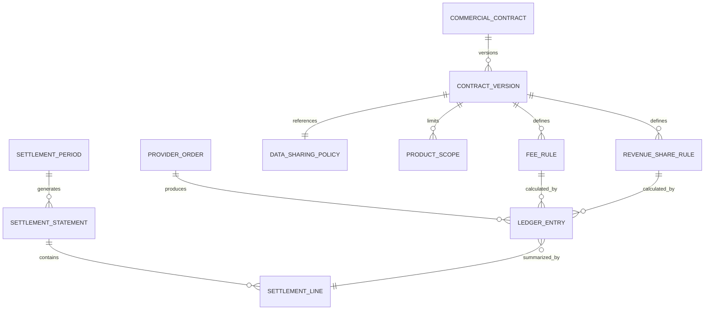

# 4. Contratos, revenue share y conciliación

## 4.1 Separar contrato técnico, política de datos y contrato económico

Una relación Disney–Rappi tiene tres objetos relacionados pero independientes:

1. **Connection:** capacidades y credenciales técnicas.
2. **Data policy:** qué puede recibir Snap Play y qué puede ver cada parte.
3. **Commercial contract:** vigencia, moneda, fees, revenue share, impuestos, refunds y settlement.

Esto permite cambiar un endpoint sin alterar la economía o limitar datos sin romper la prueba de ejecución.

## 4.2 Modelo contractual



## 4.3 Versionado y vigencia

- Un contrato tiene una o más versiones.
- Una versión aprobada es inmutable.
- `effective_from` es inclusivo y `effective_to` exclusivo.
- No puede haber versiones solapadas para el mismo territorio, moneda y scope.
- Cada orden guarda `contract_version_id` y las reglas aplicadas.
- La corrección de una regla crea una versión futura o un adjustment; nunca reescribe el pasado silenciosamente.
- Timezone y calendario de cierre se guardan explícitamente.

## 4.4 Qué es una transacción cobrable

Debe definirse contractualmente. Recomendación:

> Una orden es cobrable cuando alcanza `DELIVERED`, conserva un `tracking_token` válido emitido por Snap Play y no fue totalmente reembolsada dentro de la ventana acordada.

Alternativas soportadas:

- `ORDER_PLACED`;
- `ORDER_CONFIRMED`;
- `DELIVERED`;
- `REFUND_WINDOW_ELAPSED`;
- `PROVIDER_SETTLED`.

`DELIVERED` es un equilibrio razonable. Si se factura antes de terminar la ventana de refund, el período siguiente crea ajustes negativos.

## 4.5 Bases económicas

Una regla declara su base:

```text
ORDER_TOTAL
ITEM_GROSS_VALUE
ITEM_NET_VALUE
ELIGIBLE_ITEM_VALUE
DELIVERY_FEE
FIXED_PER_CONVERTED_ORDER
```

No deben mezclarse conceptos sin definición. Por ejemplo:

- `ORDER_TOTAL`: artículos + delivery + service fees - discounts, según contrato;
- `ELIGIBLE_ITEM_VALUE`: sólo SKUs/categorías incluidos en la regla;
- impuestos incluidos/excluidos se declaran en `tax_treatment`;
- descuentos de Rappi, Disney, marca o Snap Play deben tener un `funding_party`.

## 4.6 Ejemplo de versión contractual

```json
{
  "contract_id": "ctr_disney_rappi_ar",
  "version": 3,
  "parties": {
    "publisher_org_id": "org_disney",
    "commerce_org_id": "org_rappi",
    "orchestrator_org_id": "org_snapplay"
  },
  "territories": ["AR"],
  "currency": "ARS",
  "effective_from": "2026-09-01T00:00:00-03:00",
  "effective_to": "2027-09-01T00:00:00-03:00",
  "billable_event": "DELIVERED",
  "refund_window_days": 7,
  "settlement_frequency": "MONTHLY",
  "data_policy_id": "dsp_pseudonymous_store_only_v2",
  "rules": [
    {
      "rule_id": "fee_snapplay_execution",
      "type": "ORCHESTRATION_FEE",
      "basis": "FIXED_PER_CONVERTED_ORDER",
      "amount": 250.0,
      "currency": "ARS"
    },
    {
      "rule_id": "revshare_disney_merch",
      "type": "REVENUE_SHARE",
      "beneficiary_org_id": "org_disney",
      "basis": "ELIGIBLE_ITEM_VALUE",
      "rate_bps": 800,
      "eligible_categories": ["disney-merchandising"],
      "tax_treatment": "EXCLUSIVE"
    }
  ]
}
```

`rate_bps: 800` representa 8%; usar basis points evita errores de punto flotante. Los montos se guardan en minor units (`centavos`) como enteros.

## 4.7 Cálculo por orden

Ejemplo:

```text
Order item merchandising elegible: ARS 15.000
Otros productos:                    ARS 10.000
Delivery y fees no elegibles:       ARS  3.000
Refund merchandising:               ARS  2.000

Eligible net item value:             13.000
Disney revenue share 8%:              1.040
Snap Play fixed execution fee:          250
```

El motor produce ledger entries separados, con signo, party, regla y evidencia.

## 4.8 Ledger

El ledger es append-only. Un entry mínimo contiene:

- order y handoff;
- contract version y rule;
- event causante;
- debit party y credit party;
- amount minor units y currency;
- base amount;
- calculation input snapshot;
- status (`PENDING`, `EARNED`, `REVERSED`, `SETTLED`);
- timestamp.

Un refund no modifica el entry original: crea un reversal total o parcial.

## 4.9 Settlement


Snap Play puede inicialmente calcular y conciliar sin mover dinero. La transferencia real puede ocurrir fuera de la plataforma y registrarse mediante referencia de ERP/banco.

## 4.10 Reconciliación

Comparación mínima por orden:

- tracking/handoff token;
- provider order ref;
- estado final;
- timestamps;
- moneda;
- order total;
- eligible item value, si la regla lo requiere;
- refunds;
- fee/revenue share esperado;
- fee/revenue share reportado.

Tipos de excepción:

```text
MISSING_IN_SNAPPLAY
MISSING_IN_PROVIDER
STATUS_MISMATCH
AMOUNT_MISMATCH
PRODUCT_SCOPE_MISMATCH
DUPLICATE_ATTRIBUTION
CONTRACT_NOT_FOUND
LATE_REFUND
CURRENCY_MISMATCH
```

Tolerancias se configuran por contrato y moneda. Una diferencia nunca se oculta mediante redondeo no documentado.

## 4.11 Dashboards para cada aliado

La misma fuente de ledger y attribution se filtra por política.

Disney puede ver, si está autorizado:

- scans, handoffs, órdenes y conversión;
- ventas por channel, context, experience y placement;
- gasto y productos por usuario seudónimo;
- revenue share earned/pending/adjusted;
- estado de pedidos asociados a sesiones activas;
- settlements y diferencias.

Rappi puede ver:

- ventas atribuidas a Disney y a cada streaming aliado;
- GMV, AOV, categorías y conversiones permitidas;
- fees de Snap Play;
- revenue share debido por contrato;
- settlements y diferencias.

En `AGGREGATED` o `BILLING_ONLY`, las filas por usuario/orden se ocultan o se reducen al mínimo contractual.

## 4.12 Decisiones pendientes con negocio/legal

1. Quién paga el fee de Snap Play.
2. Si el fee se devenga en confirmación, entrega o fin de refund window.
3. Quién financia descuentos y productos promocionales.
4. Qué conceptos forman la base de revenue share.
5. Tratamiento de impuestos y retenciones por país.
6. Reglas para órdenes mixtas con productos no Disney.
7. Ventana de atribución y deduplicación entre canales.
8. Tratamiento de cancelaciones, sustituciones y partial refunds.
9. Frecuencia, moneda, FX y calendario de settlement.
10. Política de datos y base legal para reportes por usuario.
